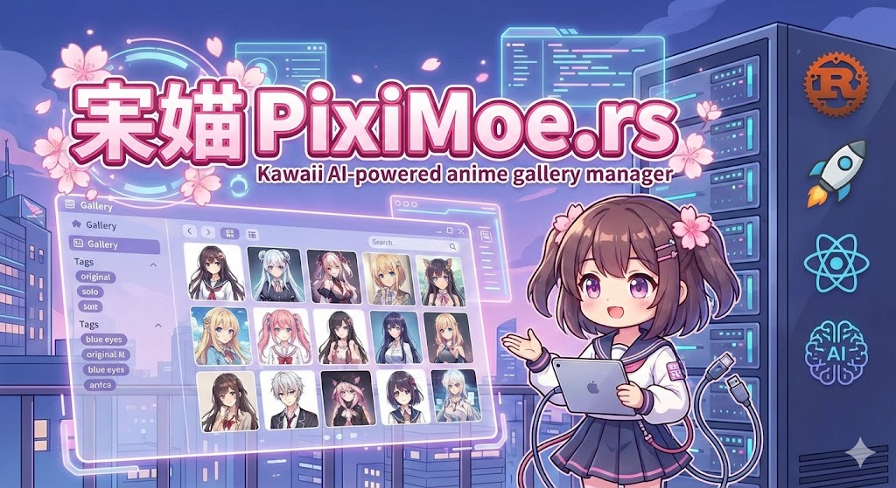
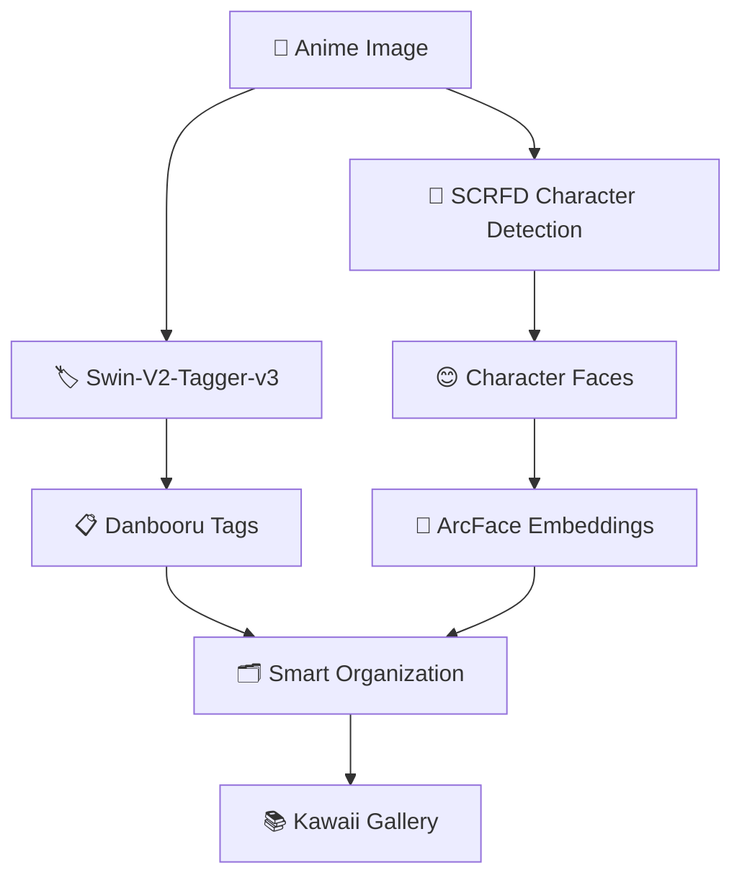

<div align="center">

# 🌸 PixiMoe.rs 🌸

[](https://www.rust-lang.org/)
[](https://tauri.app/)
[](https://www.typescriptlang.org/)
[](https://reactjs.org/)
[](https://huggingface.co/)

**🎌 AI-Powered Kawaii Anime Gallery Manager**

A blazing-fast local-first anime gallery built with Rust, featuring intelligent character recognition, Danbooru-style tagging, and kawaii organization! ✨

[](https://github.com/KiritoKing/PixiMoe.rs)
[](https://github.com/KiritoKing/PixiMoe.rs)
[](https://github.com/KiritoKing/PixiMoe.rs/issues)
[](https://opensource.org/licenses/MIT)

[](https://github.com/KiritoKing/PixiMoe.rs)
[](https://github.com/KiritoKing/PixiMoe.rs)
[](https://github.com/KiritoKing/PixiMoe.rs/actions)

---



*🎀 Your kawaii anime gallery with AI magic!*

</div>

## ✨ Features

<div align="center">

### 🎌 Anime & Art Gallery Specialization


</div>

- 🏷️ **Danbooru-Style Tagging** - 4000+ tags with Swin-V2-Tagger-v3
- 👥 **Character Recognition** - Smart character clustering across your collection
- 🎨 **Style Classification** - AI-powered art style and artist identification
- 🔞 **NSFW Detection** - Automatic content filtering and safe rating
- 📚 **Collection Management** - Smart organization by series, artist, characters

<div align="center">

### 🚀 Core Technology


</div>

- ⚡ **Extreme Performance** - Process 50,000+ images with blazing speed
- 🔒 **Local-First Architecture** - Perfect for private anime collections
- 🤖 **Zero-Config AI** - Pre-trained anime models work out of the box
- 🔍 **Content-Addressed Storage** - BLAKE3 hashing for deduplication
- 🎯 **Non-Destructive** - Original files never modified

## 🛠️ Tech Stack

<div align="center">

### 🦀 Backend


### ⚛️ Frontend


### 🤖 AI Models


</div>

## 🚀 Quick Start

<div align="center">

### 📋 Prerequisites


</div>

```bash
# Clone the repository 🎀
git clone https://github.com/KiritoKing/PixiMoe.rs.git
cd PixiMoe.rs

# Install dependencies ✨
pnpm install

# Setup database 📚
sqlx database create
sqlx migrate run

# Launch PixiMoe! 🌸
pnpm tauri dev
```

<div align="center">

**🎉 That's it! PixiMoe will automatically download AI models and start organizing your kawaii collection!**

</div>

## 📊 Performance Metrics

| Operation | GPU | CPU | Performance |
|-----------|-----|-----|-------------|
| **Thumbnail Generation** | 50ms | 100ms | ⚡⚡⚡⚡⚡ |
| **Danbooru Tagging** | 100ms | 500ms | ⚡⚡⚡⚡ |
| **Character Detection** | 50ms | 100ms | ⚡⚡⚡⚡⚡ |
| **Character Recognition** | 20ms | 50ms | ⚡⚡⚡⚡⚡ |

<div align="center">


**✅ Supports 50,000+ anime images with <4GB memory usage**

</div>

## 🧠 AI Pipeline for Anime Galleries

<div align="center">



</div>

### 🎯 AI Processing Steps

1. **🏷️ Danbooru Classification** - 4000+ tags from millions of anime images
2. **👤 Character Detection** - Specialized anime character face detection
3. **🧠 Character Embedding** - 512-dimensional vectors for recognition
4. **🔄 Smart Clustering** - Automatic character and face grouping
5. **🎨 Content Analysis** - Style, artist, series detection
6. **⚡ Hardware Optimization** - CUDA/CoreML/DirectML acceleration

## 📁 Project Structure

```
PixiMoe.rs/
├── 📂 src/                    # React Frontend
│   ├── 🎨 components/ui/       # shadcn/ui components
│   ├── ⚙️ lib/                 # Utilities & hooks
│   └── 🚀 main.tsx            # App entry point
├── 🦀 src-tauri/               # Rust Backend
│   ├── 🎯 src/
│   │   ├── 💾 db/              # Database operations
│   │   ├── 🔧 commands/        # Tauri commands
│   │   ├── 🤖 ai/              # ONNX inference
│   │   └── ❌ error.rs         # Error handling
│   └── 🧠 models/              # AI model files
├── 📚 openspec/                # Project specs
├── 🗃️ migrations/             # Database migrations
└── 💾 piximoe.db              # SQLite database
```

## 🎯 Design Philosophy

| Principle | Description | Icon |
|-----------|-------------|------|
| **🎌 Anime-First** | Every feature optimized for anime galleries | 🌸 |
| **🔒 Privacy First** | Perfect for personal collections | 🔐 |
| **⚡ Rust Performance** | Memory safety and blazing speed | 🦀 |
| **🤖 Zero Configuration** | AI models work out of the box | ✨ |
| **🏷️ Danbooru Compatible** | Familiar tags for anime community | 📋 |

## 🤝 Contributing

<div align="center">


We love contributions! Whether you're fixing bugs, adding features, or improving documentation! 🎀

**📖 See our [Contributing Guide](CONTRIBUTING.md) for details**

</div>

### 🚀 Quick Contributing Steps

```bash
# Fork & Clone 🔄
git clone https://github.com/KiritoKing/PixiMoe.rs.git
cd PixiMoe.rs

# Create Feature Branch 🌿
git checkout -b feature/your-kawaii-feature

# Make Changes & Commit 💝
git commit -m "✨ feat: add kawaii feature"

# Push & PR 🎉
git push origin feature/your-kawaii-feature
```

<div align="center">

### 🏆 Contributors


**💖 Thank you to all our contributors!**

</div>

## 📜 License

<div align="center">


This project is licensed under the MIT License - see the [LICENSE](LICENSE) file for details.

</div>

## 🙏 Acknowledgments

<div align="center">

**Special thanks to these amazing projects!**

[](https://tauri.app/)
[](https://github.com/microsoft/onnxruntime)
[](https://huggingface.co/SmilingWolf)
[](https://www.rust-lang.org/)

</div>

---

<div align="center">

**🌸 PixiMoe.rs - Where every anime pixel is kawaii and intelligently connected! 🎌**

[](#piximoers)


**Made with 💖 and 🦀 for the anime community!**

</div>

